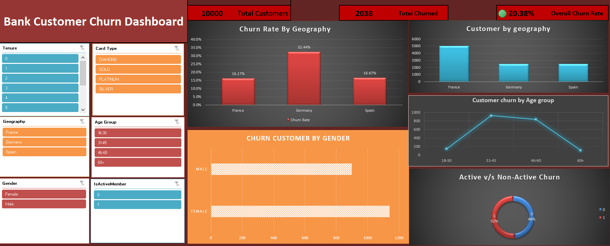

# Bank Customer Churn Analysis

## Project Overview
This project analyzes customer churn data to identify factors influencing customer attrition and customer retention.

## Tools Used
- Microsoft Excel
- MySQL

## Dashboard Preview

## Key Metrics
- Total Customers: 10,000
- Total Churned: 2,038
- Churn Rate: 20.38%

## Analysis Performed
- Churn Rate by Geography
- Customer Distribution by Geography
- Churn by Age Group
- Churn by Gender
- Active vs Non-Active Customer Analysis
- Card Type Analysis

## Key Insights
- Germany had the highest churn rate.
- Customers aged 31–45 showed the highest churn volume.
- Inactive customers were more likely to churn.
- Female customers had higher churn counts than male customers.

## Files Included
- Bank Customer Churn Analysis.xlsx
- Bank_customer_churn_analysis_Queries.sql
- Dashboard.png
